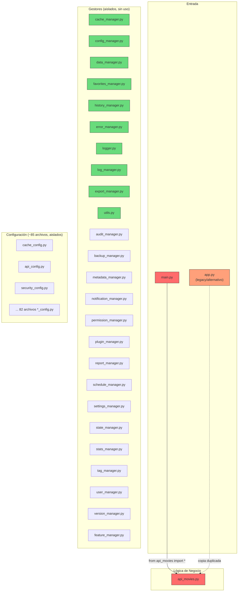
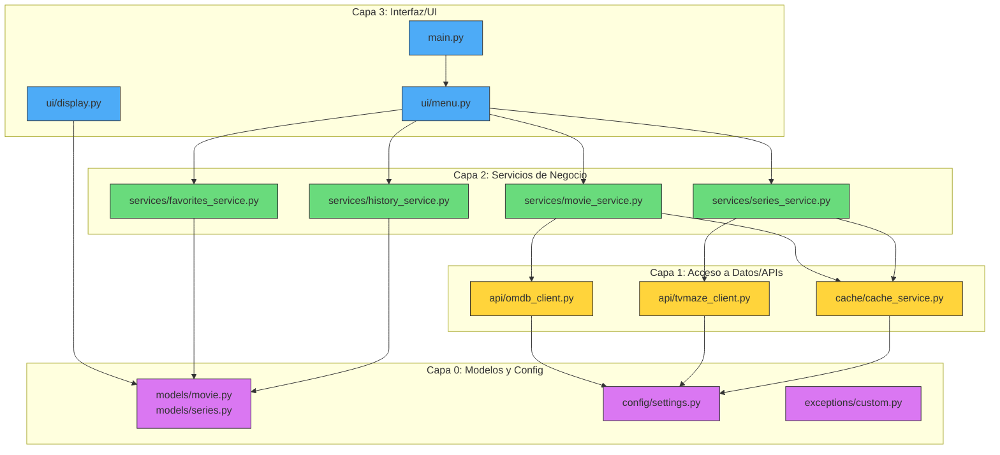

# Hito 2: Diagnóstico de Dependencias e Importaciones

**Objetivo:** Mapear y analizar el árbol de dependencias e importaciones entre todos los módulos del proyecto.

**Fecha:** 2026-09-17

**Regla aplicada:** Sin modificación de archivos — solo diagnóstico.

---

## 1. Resumen Ejecutivo

**Hallazgo clave:** El proyecto tiene un acoplamiento paradójico — los módulos están **aislados a nivel de imports** (casi ninguno importa de otro), pero están **fuertemente acoplados a nivel de estado global** compartido.

---

## 2. Matriz de Dependencias Internas

### Única dependencia directa entre módulos del proyecto:

```
main.py ──wildcard──▶ api_movies.py
```

**No hay dependencias circulares** porque los módulos no se importan entre sí.

---

## 3. Diagrama Mermaid — Arquitectura Actual



---

## 4. Clasificación por Capas (Estado Actual)

| Capa | Archivos | Estado |
|------|----------|--------|
| **Entrada** | `main.py`, `app.py` | ❌ Duplicados, mezclan UI + lógica |
| **Lógica/API** | `api_movies.py` | ❌ Mezcla API + negocio + estado global |
| **Gestores** | 22 archivos `*_manager.py` | ⚠️ Aislados, **no importados por nadie** |
| **Configuración** | ~85 archivos `*_config.py` | ⚠️ Aislados, **no importados por nadie** |
| **Utilidades** | `utils.py` | ⚠️ Aislado, **no importado por nadie** |

---

## 5. Dependencias Estándar por Módulo

| Módulo | `os` | `json` | `time` | `datetime` | `csv` | `sys` | `random` | `requests` |
|--------|:----:|:------:|:------:|:----------:|:-----:|:-----:|:--------:|:----------:|
| `api_movies.py` | - | ✅ | - | - | - | - | - | ✅ |
| `main.py` | ✅ | - | ✅ | - | - | ✅ | ✅ | - |
| `app.py` | ✅ | ✅ | ✅ | - | - | ✅ | ✅ | ✅ |
| `*_manager.py` (22) | ✅ | ✅ | ✅ | ✅ | Algunos | - | - | - |
| `*_config.py` (~85) | ✅ | ✅ | ✅ | ✅ | - | - | - | - |
| `utils.py` | ✅ | - | ✅ | ✅ | - | ✅ | ✅ | - |

**Única dependencia externa:** `requests` (usada por `api_movies.py` y `app.py`)

---

## 6. Análisis de Acoplamiento

| Módulo | Acoplamiento | Razón |
|--------|:------------:|-------|
| `api_movies.py` | **ALTO** | 6 variables globales mutables + wildcard import hacia `main.py` |
| `main.py` | **ALTO** | Depende 100% de `api_movies.py` vía wildcard, accede directo a su estado |
| `app.py` | **MEDIO** | Duplicado de `api_movies.py` + `main.py`, autocontenido |
| `*_manager.py` (22) | **BAJO** | Completamente aislados, pero **muertos** (nadie los usa) |
| `*_config.py` (~85) | **BAJO** | Completamente aislados, pero **muertos** (nadie los usa) |
| `utils.py` | **BAJO** | Completamente aislado, **muerto** (nadie lo usa) |

---

## 7. Problemas Críticos Identificados

### 7.1 Código Muerto Masivo
- **22 gestores** (`*_manager.py`) no son importados por ningún módulo
- **~85 archivos de configuración** no son importados por ningún módulo
- `utils.py` no es importado por ningún módulo
- `app.py` es una copia duplicada de `api_movies.py` + partes de `main.py`

### 7.2 Acoplamiento por Estado Global (no por imports)
Aunque los módulos no se importan entre sí, están acoplados implícitamente:
- `main.py` modifica `CONFIG` de `api_movies.py` directamente
- `main.py` lee/escribe `PELICULAS_FAVORITAS` y `HISTORIAL_BUSQUEDAS` de `api_movies.py`
- Todo el estado vive en variables globales mutables

### 7.3 Duplicación Funcional
| Funcionalidad | Implementaciones |
|---------------|------------------|
| Cache | `cache_manager.py`, `cache_manager_v2.py`, `cache_config.py`, `CACHE_PELICULAS`/`CACHE_SERIES` en `api_movies.py` |
| Logging | `logger.py`, `log_manager.py`, `log_config.py` |
| Configuración | `config_manager.py`, `config_manager_v2.py`, `api_config.py`, `CONFIG` en `api_movies.py` |
| Favoritos | `favorites_manager.py`, `PELICULAS_FAVORITAS` en `api_movies.py` |
| Historial | `history_manager.py`, `HISTORIAL_BUSQUEDAS` en `api_movies.py` |
| Exportación | `export_manager.py`, `exportar_a_json()` en `api_movies.py` |

---

## 8. Propuesta de Jerarquía de Capas (Target)



---

## 9. Resumen Cuantitativo

| Métrica | Valor |
|---------|-------|
| Total archivos Python | 124 |
| Archivos con código vivo (usados) | 2 (`api_movies.py`, `main.py`) |
| Archivos muertos (no importados) | 122 |
| Archivos duplicados funcionales | ~6 (`app.py`, managers vs api_movies) |
| Dependencias externas | 1 (`requests`) |
| Dependencias circulares | 0 |
| Wildcard imports | 1 (crítico) |

---

## Estado: Diagnóstico Completo ✅

**Siguiente paso:** Aguardando instrucciones para la fase de refactorización.
