# Hito 4: Diagnóstico de Duplicación de Código

**Objetivo:** Identificar, auditar y documentar toda la duplicación de código en el proyecto.

**Fecha:** 2026-09-17

**Regla aplicada:** Sin modificación de archivos fuente — solo diagnóstico.

---

## 1. Resumen Ejecutivo

| Métrica | Valor |
|---------|-------|
| Total líneas Python | **19,122** |
| Líneas en `*_config.py` (88 archivos) | **13,358** (69.9%) |
| Líneas en `*_manager.py` (23 archivos) | **4,130** (21.6%) |
| Líneas core (5 archivos) | **1,191** (6.2%) |
| **% de código duplicado/derivado** | **~91.5%** |
| Funciones duplicadas (mismo nombre+aridad en 2+ archivos) | **96** |

---

## 2. Categorías de Duplicación

### 2.1 Duplicación Masiva: Archivos `*_config.py` (88 archivos)

Los 88 archivos de configuración siguen **exactamente el mismo patrón**:

```python
# Patrón idéntico en 88 archivos
import os, json, time
from datetime import datetime

GLOBAL_CONFIG = {}
CONFIG_FILE = "xxx.json"

def load_xxx_config(): ...      # Cargar de JSON
def save_xxx_config(): ...      # Guardar a JSON
def get_xxx_setting(key): ...   # Getter genérico
def set_xxx_setting(key, val):  # Setter genérico
def reset_xxx_config(): ...     # Reset a defaults
def export_xxx_config(f): ...   # Exportar
def import_xxx_config(f): ...   # Importar
def validate_xxx_config(): ...  # Validar
def backup_xxx_config(): ...    # Backup
def restore_xxx_config(): ...   # Restore
def get_xxx_config_summary():   # Resumen
```

**Impacto:** ~13,358 líneas que podrían reducirse a **~100 líneas** con una clase genérica `ConfigManager`.

---

### 2.2 Duplicación de Funciones entre Config Files

| Función duplicada | Archivos | Patrón |
|-------------------|----------|--------|
| `enable/disable_compression()` | `performance_config.py`, `api_performance_config.py`, `backup_config.py` | 3 copias |
| `enable/disable_auto_recovery()` | `api_cache_failover_config.py`, `api_cache_recovery_config.py` | 2 copias |
| `enable/disable_backup()` | `database_config.py`, `backup_config.py` | 2 copias |
| `enable/disable_ssl_verification()` | `api_security_config.py`, `network_config.py` | 2 copias |
| `get/set_max_retries()` | `api_retry_config.py`, `network_config.py` | 2 copias |
| `get/set_retry_delay()` | `api_retry_config.py`, `network_config.py` | 2 copias |
| `get/set_user_agent()` | `api_security_config.py`, `network_config.py` | 2 copias |
| `get/set_connect_timeout()` | `api_timeout_retry_config.py`, `api_timeout_config.py` | 2 copias |
| `get/set_max_size_mb()` | `cache_config.py`, `log_config.py` | 2 copias |
| `get/set_theme()` | `display_config.py`, `ui_config.py` | 2 copias |
| `get/set_backup_dir()` | `backup_config.py`, `storage_config.py` | 2 copias |

---

### 2.3 Duplicación entre `main.py` y `app.py`

**13 funciones duplicadas** con variaciones del 34% al 93% de similitud:

| Función | Similitud | Observación |
|---------|:---------:|-------------|
| `funcion_buscar_series()` | **93%** | Casi idéntica |
| `funcion_peliculas_populares()` | **92%** | Casi idéntica |
| `print_header()` | 77% | Diferencia menor |
| `mostrar_serie()` | 71% | Diferencia menor |
| `funcion_ver_historial()` | 70% | Diferencia menor |
| `clear_screen()` | 76% | Diferencia menor |
| `delay()` | 76% | Diferencia menor |
| `funcion_ver_favoritos()` | 63% | Variaciones medias |
| `mostrar_lista_peliculas()` | 49% | Variaciones altas |
| `mostrar_pelicula()` | 45% | Variaciones altas |
| `menu_principal()` | 40% | Variaciones altas |
| `funcion_buscar_pelicula()` | 38% | Implementaciones divergentes |
| `funcion_buscar_actor()` | 34% | Implementaciones divergentes |

**`app.py` es un duplicado parcial/legacy de `main.py` + `api_movies.py`.**

---

### 2.4 Duplicación entre `cache_manager.py` y `cache_manager_v2.py`

**9 funciones idénticas:**

| Función | Líneas en v1 | Líneas en v2 |
|---------|:------------:|:------------:|
| `init_cache()` | 10-13 | 10-13 |
| `get_cache_key()` | 15-17 | 15-17 |
| `save_to_cache()` | 19-31 | 19-31 |
| `get_from_cache()` | 33-53 | 33-53 |
| `clear_cache()` | 55-65 | 55-65 |
| `remove_from_cache()` | 67-76 | 67-76 |
| `get_cache_stats()` | 78-96 | 78-96 |
| `export_cache()` | 130-138 | 130-138 |
| `import_cache()` | 140-148 | 140-148 |

---

### 2.5 Duplicación entre `logger.py` y `log_manager.py`

| Función | Duplicada | Implementación |
|---------|:---------:|----------------|
| `log_debug()` | ✅ | Ambas escriben a archivo + consola |
| `log_info()` | ✅ | Idem |
| `log_warning()` | ✅ | Idem |
| `log_error()` | ✅ | Idem |
| `log_critical()` | ✅ | Idem |
| `get_log_stats()` | ✅ | Misma lógica de conteo |
| `parse_log_line()` | ✅ | Mismo parsing |
| `filter_log_by_level()` | ✅ | Mismo filtrado |

---

### 2.6 Duplicación de Lógica de Negocio en `*_manager.py`

| Funcionalidad | Implementaciones |
|---------------|------------------|
| `add_favorite()` | `favorites_manager.py`, `data_manager.py` |
| `remove_favorite()` | `favorites_manager.py`, `data_manager.py` |
| `get_favorites()` | `favorites_manager.py`, `state_manager.py` |
| `add_to_history()` | `state_manager.py`, `data_manager.py` |
| `get_history()` | `state_manager.py`, `data_manager.py`, `history_manager.py` |
| `clear_history()` | `state_manager.py`, `data_manager.py`, `history_manager.py` |
| `get_stats()` | `data_manager.py`, `stats_manager.py` |
| `get_error_stats()` | `stats_manager.py`, `error_manager.py` |
| `list_backups()` | `data_manager.py`, `backup_manager.py` |
| `restore_backup()` | `data_manager.py`, `export_manager.py`, `backup_manager.py` |
| `export_to_csv()` | `export_manager.py`, `utils.py` |
| `export_to_json()` | `export_manager.py`, `utils.py` |
| `import_from_csv()` | `data_manager.py`, `export_manager.py` |

---

## 3. Mapa Visual de Duplicación

```mermaid
graph TD
    subgraph "Duplicación Masiva (88 archivos)"
        CFG1["api_cache_config.py<br/>~150 líneas"]
        CFG2["api_cache_security_config.py<br/>~156 líneas"]
        CFG3["cache_config.py<br/>~137 líneas"]
        CFG4["...85 archivos más<br/>mismo patrón"]
    end

    subgraph "Duplicación Funcional (23 managers)"
        MGR1["favorites_manager.py"]
        MGR2["data_manager.py"]
        MGR3["state_manager.py"]
        MGR4["history_manager.py"]
        MGR5["stats_manager.py"]
        MGR6["error_manager.py"]
        MGR7["backup_manager.py"]
        MGR8["export_manager.py"]
    end

    subgraph "Duplicación de Archivos Completos"
        APP["app.py<br/>(copia de main.py + api_movies.py)"]
        CACHE2["cache_manager_v2.py<br/>(copia de cache_manager.py)"]
        CFGM2["config_manager_v2.py<br/>(copia de config_manager.py)"]
        LOG2["log_manager.py<br/>(copia de logger.py)"]
    end

    subgraph "Duplicación en Código Core"
        MAIN["main.py"]
        UTILS["utils.py"]
    end

    CFG1 -.-|"~100% mismo patrón"| CFG2
    CFG2 -.-|"~100% mismo patrón"| CFG3
    CFG3 -.-|"~100% mismo patrón"| CFG4

    MGR1 -->|"add/remove/get"| MGR2
    MGR2 -->|"get_history"| MGR3
    MGR3 -->|"get_history"| MGR4
    MGR5 -->|"get_error_stats"| MGR6

    APP -.-|"13 funciones"| MAIN
    CACHE2 -.-|"9 funciones"| MGR8
    LOG2 -.-|"8 funciones"| MGR8

    MAIN -.-|"format_movie_display"| UTILS

    style CFG1 fill:#ff6b6b,stroke:#333
    style CFG2 fill:#ff6b6b,stroke:#333
    style CFG3 fill:#ff6b6b,stroke:#333
    style CFG4 fill:#ff6b6b,stroke:#333
    style APP fill:#ffa07a,stroke:#333
    style CACHE2 fill:#ffa07a,stroke:#333
    style CFGM2 fill:#ffa07a,stroke:#333
    style LOG2 fill:#ffa07a,stroke:#333
```



---

## 4. Impacto Cuantitativo

| Categoría | Líneas actuales | Líneas estimadas tras refactor | Reducción |
|-----------|:---------------:|:------------------------------:|:---------:|
| 88 `*_config.py` | 13,358 | ~150 | **98.9%** |
| 23 `*_manager.py` | 4,130 | ~800 | **80.6%** |
| `app.py` (duplicado) | 255 | 0 (eliminar) | **100%** |
| `cache_manager_v2.py` | 156 | 0 (eliminar) | **100%** |
| `config_manager_v2.py` | 168 | 0 (eliminar) | **100%** |
| `log_manager.py` | 197 | 0 (eliminar) | **100%** |
| **Total** | **18,264** | **~950** | **~94.8%** |

---

## 5. Prioridad de Eliminación

| Prioridad | Acción | Impacto |
|-----------|--------|---------|
| 🔴 **Crítica** | Consolidar 88 `*_config.py` en 1 clase genérica | Elimina 13,200 líneas |
| 🔴 **Crítica** | Eliminar `app.py` (duplicado de main.py + api_movies.py) | Elimina confusión |
| 🟠 **Alta** | Eliminar `cache_manager_v2.py` y `config_manager_v2.py` | Elimina duplicados directos |
| 🟠 **Alta** | Consolidar `logger.py` + `log_manager.py` en 1 módulo | Elimina 197 líneas |
| 🟡 **Media** | Consolidar managers duplicados (favorites, history, data) | Reduce acoplamiento |
| 🟢 **Baja** | Eliminar `utils.py` (no usado por nadie) | Código muerto |

---

## Estado: Diagnóstico Completo ✅

**Siguiente paso:** Aguardando instrucciones para la estrategia de eliminación de duplicación.
