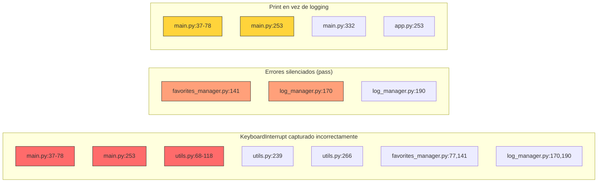

# Hito 3: Diagnóstico de Manejo de Excepciones

**Objetivo:** Localizar, auditar y documentar todos los bloques `bare except:`, capturas genéricas y prácticas deficientes de manejo de excepciones.

**Fecha:** 2026-09-17

**Regla aplicada:** Sin modificación de archivos fuente — solo diagnóstico.

---

## 1. Resumen Ejecutivo

| Métrica | Cantidad |
|---------|----------|
| `bare except:` | **28** |
| `except Exception` genérico | **2** |
| `except` + `pass` (silenciamiento) | **4** |
| `except` + `print()` (sin logging) | **14** |
| **Total de bloques deficientes** | **30** |

---

## 2. Hallazgos por Archivo

### 2.1 `main.py` — 11 hallazgos

#### H1–H9: Líneas 37–78 — `mostrar_pelicula()`

```python
def mostrar_pelicula(pelicula):
    try:
        print("Título: " + pelicula["Title"])
    except:                          # bare except × 9
        print("Título: N/A")
    # ... patrón repetido para Year, imdbRating, Genre, Director, Actors, Plot, Country, Awards
```

| Hallazgo | Líneas | Excepción real esperada | Riesgo | Propuesta |
|----------|--------|------------------------|--------|-----------|
| H1 | 37 | `KeyError` | Captura `KeyboardInterrupt`, `SystemExit` | `pelicula.get("Title", "N/A")` |
| H2 | 42 | `KeyError` | Idem | Idem |
| H3 | 47 | `KeyError` | Idem | Idem |
| H4 | 52 | `KeyError` | Idem | Idem |
| H5 | 57 | `KeyError` | Idem | Idem |
| H6 | 62 | `KeyError` | Idem | Idem |
| H7 | 67 | `KeyError` | Idem | Idem |
| H8 | 72 | `KeyError` | Idem | Idem |
| H9 | 77 | `KeyError` | Idem | Idem |

**Impacto:** 9 bloques innecesarios. El problema real es acceso con `[]` en vez de `.get()`. Captura cualquier excepción incluyendo `KeyboardInterrupt`.

**Propuesta:** Eliminar todos los `try/except` y usar `pelicula.get("clave", "N/A")`.

---

#### H10: Línea 253 — `funcion_importar()`

```python
def funcion_importar():
    try:
        importar_de_json(nombre + ".json")
    except:                          # bare except
        print("Error al importar archivo")
```

| Hallazgo | Línea | Excepciones reales esperadas | Riesgo | Propuesta |
|----------|-------|------------------------------|--------|-----------|
| H10 | 253 | `FileNotFoundError`, `json.JSONDecodeError`, `PermissionError` | Silencia errores críticos, oculta `KeyboardInterrupt` | `except (FileNotFoundError, json.JSONDecodeError) as e:` + logging |

---

#### H11: Línea 332 — Bloque principal

```python
if __name__ == "__main__":
    try:
        menu_principal()
    except KeyboardInterrupt:
        print("\n\nPrograma interrumpido")
        sys.exit(0)
    except Exception as e:           # demasiado amplio
        print("Error inesperado: " + str(e))
        sys.exit(1)
```

| Hallazgo | Línea | Riesgo | Propuesta |
|----------|-------|--------|-----------|
| H11 | 332 | `except Exception` captura todo sin logging. `str(e)` pierde traceback. | Usar `logging.exception()` o `traceback.print_exc()` |

---

### 2.2 `utils.py` — 14 hallazgos

#### H12–H22: Líneas 68–118 — `format_movie_display()`

```python
def format_movie_display(movie):
    try:
        lines.append("Título: " + movie["Title"])
    except:                          # bare except × 11
        lines.append("Título: N/A")
```

| Hallazgo | Líneas | Excepción real esperada | Riesgo | Propuesta |
|----------|--------|------------------------|--------|-----------|
| H12 | 68 | `KeyError` | Captura todo | `.get()` |
| H13 | 73 | `KeyError` | Idem | `.get()` |
| H14 | 78 | `KeyError` | Idem | `.get()` |
| H15 | 83 | `KeyError` | Idem | `.get()` |
| H16 | 88 | `KeyError` | Idem | `.get()` |
| H17 | 93 | `KeyError` | Idem | `.get()` |
| H18 | 98 | `KeyError` | Idem | `.get()` |
| H19 | 103 | `KeyError` | Idem | `.get()` |
| H20 | 108 | `KeyError` | Idem | `.get()` |
| H21 | 113 | `KeyError` | Idem | `.get()` |
| H22 | 118 | `KeyError` | Idem | `.get()` |

**Mismo patrón que `main.py:mostrar_pelicula()`.** Código duplicado + misma mala práctica.

---

#### H23: Línea 239 — `validate_date()`

```python
def validate_date(date_str):
    try:
        datetime.strptime(date_str, "%Y-%m-%d")
        return True
    except:                          # bare except
        return False
```

| Hallazgo | Línea | Excepción real esperada | Riesgo | Propuesta |
|----------|-------|------------------------|--------|-----------|
| H23 | 239 | `ValueError` | Captura `KeyboardInterrupt` | `except ValueError:` |

---

#### H24: Línea 266 — `sort_items()`

```python
def sort_items(items, key, reverse=False):
    try:
        return sorted(items, key=lambda x: x.get(key, ""), reverse=reverse)
    except:                          # bare except
        return items
```

| Hallazgo | Línea | Excepciones reales esperadas | Riesgo | Propuesta |
|----------|-------|------------------------------|--------|-----------|
| H24 | 266 | `TypeError`, `AttributeError` | Silencia errores de datos | `except (TypeError, AttributeError):` |

---

### 2.3 `favorites_manager.py` — 2 hallazgos

#### H25: Línea 77 — `sort_favorites()`

```python
def sort_favorites(key, reverse=False):
    try:
        return sorted(favorites, key=lambda x: x.get(key, ""), reverse=reverse)
    except:                          # bare except
        return favorites.copy()
```

| Hallazgo | Línea | Excepciones reales esperadas | Riesgo | Propuesta |
|----------|-------|------------------------------|--------|-----------|
| H25 | 77 | `TypeError`, `AttributeError` | Misma duplicación que `utils.py:sort_items()` | `except (TypeError, AttributeError):` |

---

#### H26: Línea 141 — `get_favorites_stats()`

```python
rating = fav.get("imdbRating")
if rating and rating != "N/A":
    try:
        total_rating += float(rating)
        rating_count += 1
    except:                          # bare except + pass
        pass
```

| Hallazgo | Línea | Excepción real esperada | Riesgo | Propuesta |
|----------|-------|------------------------|--------|-----------|
| H26 | 141 | `ValueError` | Silencia conversiones inválidas | `except ValueError:` + log.debug |

---

### 2.4 `log_manager.py` — 2 hallazgos

#### H27: Línea 170 — `parse_log_line()`

```python
def parse_log_line(line):
    try:
        parts = line.split(" - ", 2)
        if len(parts) >= 3:
            return { ... }
    except:                          # bare except + pass
        pass
    return {"timestamp": "", "level": "", "message": line}
```

| Hallazgo | Línea | Excepciones reales esperadas | Riesgo | Propuesta |
|----------|-------|------------------------------|--------|-----------|
| H27 | 170 | `IndexError`, `AttributeError` | Silencia errores de parsing | `except (IndexError, AttributeError):` |

---

#### H28: Línea 190 — `validate_log_format()`

```python
def validate_log_format(line):
    try:
        parts = line.split(" - ", 2)
        if len(parts) >= 3:
            datetime.strptime(parts[0], "%Y-%m-%d %H:%M:%S")
            ...
    except:                          # bare except
        pass
    return False
```

| Hallazgo | Línea | Excepciones reales esperadas | Riesgo | Propuesta |
|----------|-------|------------------------------|--------|-----------|
| H28 | 190 | `ValueError`, `IndexError` | Silencia errores de validación | `except (ValueError, IndexError):` |

---

### 2.5 `app.py` — 1 hallazgo

#### H29: Línea 253 — Bloque principal

```python
except Exception as e:           # demasiado amplio
    print("Error inesperado: " + str(e))
    sys.exit(1)
```

| Hallazgo | Línea | Riesgo | Propuesta |
|----------|-------|--------|-----------|
| H29 | 253 | Pierde traceback, `str(e)` insuficiente | `logging.exception("Error inesperado")` |

---

## 3. Resumen por Tipo de Problema

| Tipo | Cantidad | Archivos afectados |
|------|----------|-------------------|
| `bare except:` | 28 | `main.py`, `utils.py`, `favorites_manager.py`, `log_manager.py` |
| `except Exception` genérico | 2 | `main.py`, `app.py` |
| `except` + `pass` (silenciamiento) | 4 | `favorites_manager.py`, `log_manager.py` |
| `except` + `print()` (sin logging) | 14 | `main.py`, `app.py` |
| Duplicación de patrón `try/except` para dict keys | 20 | `main.py`, `utils.py` |

---

## 4. Mapa de Impacto



---

## 5. Propuesta de Excepciones de Dominio Personalizadas

```python
# exceptions.py
class PeliculasSeriesError(Exception):
    """Excepción base del dominio"""

class APIConnectionError(PeliculasSeriesError):
    """Error de conexión a API externa"""

class PeliculaNoEncontrada(PeliculasSeriesError):
    """Película no encontrada en API"""

class SerieNoEncontrada(PeliculasSeriesError):
    """Serie no encontrada en API"""

class DatosInvalidosError(PeliculasSeriesError):
    """Datos recibidos de API inválidos"""

class ArchivoImportacionError(PeliculasSeriesError):
    """Error al importar/exportar archivo"""

class ConfiguracionError(PeliculasSeriesError):
    """Error en configuración"""
```

---

## 6. Prioridad de Corrección

| Prioridad | Hallazgos | Acción |
|-----------|-----------|--------|
| 🔴 **Crítica** | H10, H11, H29 | Excepciones en importación y bloque principal — pueden ocultar fallos graves |
| 🟠 **Alta** | H1–H9, H12–H22 | 20 bloques `try/except` innecesarios — reemplazar por `.get()` |
| 🟡 **Media** | H23–H28 | `bare except` con `pass` — silencian errores |
| 🟢 **Baja** | Duplicación | Unificar `format_movie_display()` de `main.py` y `utils.py` |

---

## Estado: Diagnóstico Completo ✅

**Siguiente paso:** Aguardando instrucciones para la estrategia de corrección.
