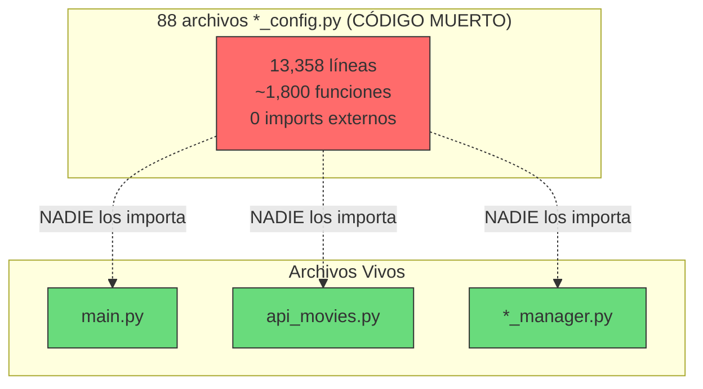

# Hito 5: Diagnóstico de Archivos `*_config.py` No Usados

**Objetivo:** Documentar todos los archivos `*_config.py` que no son utilizados por ningún módulo del proyecto.

**Fecha:** 2026-09-17

**Regla aplicada:** Sin modificación de archivos fuente — solo diagnóstico.

---

## 1. Resumen Ejecutivo

| Métrica | Valor |
|---------|-------|
| Total archivos `*_config.py` | **88** |
| Archivos importados por otro módulo | **0** |
| Archivos con referencias externas reales | **0** |
| **% de código muerto** | **100%** |
| Líneas totales desperdiciadas | **13,358** |

---

## 2. Verificación de Uso

### Método de análisis:
Se buscó en **todos** los archivos `.py` del proyecto cualquier referencia a cada archivo `*_config.py` mediante:
- Sentencias `import` o `from ... import`
- Referencias por nombre de módulo en código

### Resultado: **NINGÚN** archivo `*_config.py` es importado o referenciado por otro módulo.

```
0 referencias: accessibility_config.py
0 referencias: api_auth_config.py
0 referencias: api_bulkhead_config.py
0 referencias: api_cache_alerting_config.py
0 referencias: api_cache_analytics_config.py
0 referencias: api_cache_architecture_config.py
0 referencias: api_cache_best_practices_config.py
0 referencias: api_cache_cleanup_config.py
0 referencias: api_cache_collaboration_config.py
0 referencias: api_cache_compliance_config.py
0 referencias: api_cache_compression_config.py
0 referencias: api_cache_config.py
0 referencias: api_cache_debug_config.py
0 referencias: api_cache_deprecation_config.py
0 referencias: api_cache_deprecation_schedule_config.py
0 referencias: api_cache_disaster_recovery_config.py
0 referencias: api_cache_distribution_config.py
0 referencias: api_cache_documentation_config.py
0 referencias: api_cache_evolution_config.py
0 referencias: api_cache_failover_config.py
0 referencias: api_cache_future_config.py
0 referencias: api_cache_governance_config.py
0 referencias: api_cache_innovation_config.py
0 referencias: api_cache_integration_config.py
0 referencias: api_cache_intelligence_config.py
0 referencias: api_cache_invalidation_config.py
0 referencias: api_cache_legacy_config.py
0 referencias: api_cache_lifecycle_config.py
0 referencias: api_cache_load_testing_config.py
0 referencias: api_cache_mentoring_config.py
0 referencias: api_cache_metrics_config.py
0 referencias: api_cache_migration_config.py
0 referencias: api_cache_migration_schedule_config.py
0 referencias: api_cache_monitoring_config.py
0 referencias: api_cache_observability_config.py
0 referencias: api_cache_performance_config.py
0 referencias: api_cache_performance_testing_config.py
0 referencias: api_cache_preloading_config.py
0 referencias: api_cache_recommendations_config.py
0 referencias: api_cache_recovery_config.py
0 referencias: api_cache_reporting_config.py
0 referencias: api_cache_resilience_testing_config.py
0 referencias: api_cache_scalability_config.py
0 referencias: api_cache_security_config.py
0 referencias: api_cache_security_testing_config.py
0 referencias: api_cache_serialization_config.py
0 referencias: api_cache_stress_testing_config.py
0 referencias: api_cache_testing_config.py
0 referencias: api_cache_training_config.py
0 referencias: api_cache_validation_config.py
0 referencias: api_cache_warming_config.py
0 referencias: api_caching_strategy_config.py
0 referencias: api_circuit_breaker_config.py
0 referencias: api_config.py
0 referencias: api_debug_config.py
0 referencias: api_degradation_config.py
0 referencias: api_error_handling_config.py
0 referencias: api_failover_config.py
0 referencias: api_logging_config.py
0 referencias: api_monitoring_config.py
0 referencias: api_performance_config.py
0 referencias: api_rate_limit_config.py
0 referencias: api_rate_limiter_config.py
0 referencias: api_retry_config.py
0 referencias: api_security_config.py
0 referencias: api_testing_config.py
0 referencias: api_timeout_config.py
0 referencias: api_timeout_retry_config.py
0 referencias: backup_config.py
0 referencias: cache_expiry_config.py
0 referencias: database_config.py
0 referencias: display_config.py
0 referencias: email_config.py
0 referencias: language_config.py
0 referencias: log_config.py
0 referencias: maintenance_config.py
0 referencias: network_config.py
0 referencias: notification_config.py
0 referencias: privacy_config.py
0 referencias: proxy_config.py
0 referencias: search_config.py
0 referencias: storage_config.py
0 referencias: theme_config.py
0 referencias: ui_config.py
```

---

## 3. Archivos Core que NO Importan Ningún Config

| Archivo | Imports | ¿Usa algún `*_config.py`? |
|---------|---------|:-------------------------:|
| `main.py` | `sys`, `os`, `time`, `random`, `api_movies` | ❌ No |
| `app.py` | `requests`, `json`, `sys`, `os`, `time`, `random` | ❌ No |
| `api_movies.py` | `requests`, `json` | ❌ No |
| `utils.py` | `os`, `sys`, `time`, `random`, `datetime` | ❌ No |
| `logger.py` | `json`, `os`, `time`, `datetime` | ❌ No |
| `log_manager.py` | `os`, `json`, `time`, `datetime` | ❌ No |
| `cache_manager.py` | `json`, `os`, `time` | ❌ No |
| `config_manager.py` | `json`, `os` | ❌ No |
| `data_manager.py` | `json`, `os`, `csv`, `datetime` | ❌ No |
| `favorites_manager.py` | `os`, `json`, `time`, `datetime` | ❌ No |
| `history_manager.py` | `os`, `json`, `time`, `datetime` | ❌ No |
| `error_manager.py` | `os`, `json`, `time`, `datetime` | ❌ No |

**Conclusión:** Los `*_config.py` son código 100% muerto. Nadie los importa, nadie los usa.

---

## 4. Categorización por Tema

| Categoría | Cantidad | Archivos |
|-----------|:--------:|----------|
| **API Cache** | 43 | `api_cache_*.py` |
| **API General** | 16 | `api_*.py` (sin cache) |
| **Sistema** | 29 | `backup_`, `cache_`, `database_`, `debug_`, `display_`, `email_`, `language_`, `log_`, `maintenance_`, `network_`, `notification_`, `performance_`, `privacy_`, `proxy_`, `search_`, `security_`, `storage_`, `theme_`, `ui_` |
| **Total** | **88** | — |

---

## 5. Top 10 Archivos Más Grandes (Líneas desperdiciadas)

| Archivo | Líneas | Funciones |
|---------|:------:|:---------:|
| `api_cache_future_config.py` | 196 | 26 |
| `api_cache_legacy_config.py` | 175 | 25 |
| `debug_config.py` | 172 | 27 |
| `api_config.py` | 171 | 20 |
| `notification_config.py` | 167 | 26 |
| `search_config.py` | 165 | 25 |
| `api_cache_integration_config.py` | 164 | 24 |
| `display_config.py` | 161 | 25 |
| `backup_config.py` | 160 | 22 |
| `api_debug_config.py` | 156 | 22 |

---

## 6. Patrón Idéntico en Todos los Archivos

Todos los 88 archivos siguen esta plantilla exacta:

```python
import os
import json
import time
from datetime import datetime

# Variables globales
XXX_CONFIG_FILE = "xxx.json"
xxx_config = {}

def load_xxx_config():
    global xxx_config
    if os.path.exists(XXX_CONFIG_FILE):
        with open(XXX_CONFIG_FILE, 'r') as f:
            xxx_config = json.load(f)
    else:
        xxx_config = { ... }  # defaults

def save_xxx_config():
    with open(XXX_CONFIG_FILE, 'w') as f:
        json.dump(xxx_config, f, indent=4)

def get_xxx_setting(key): ...
def set_xxx_setting(key, value): ...
def get_all_xxx_settings(): ...
def reset_xxx_config(): ...
def enable_xxx(): ...
def disable_xxx(): ...
def is_xxx_enabled(): ...
def export_xxx_config(filename): ...
def import_xxx_config(filename): ...
def validate_xxx_config(): ...
def backup_xxx_config(): ...
def restore_xxx_config(backup_name): ...
def get_xxx_config_summary(): ...

# Auto-load
load_xxx_config()
```

---

## 7. Mapa de Impacto



---

## 8. Recomendación

| Acción | Impacto |
|--------|---------|
| **Eliminar los 88 archivos** `*_config.py` | Reduce el proyecto de 124 a **36 archivos** |
| **Eliminar 13,358 líneas muertas** | Reduce el código de 19,122 a **5,764 líneas** |
| **Reemplazar por 1 clase genérica** `ConfigManager` | ~100 líneas para toda la configuración |

---

## Estado: Diagnóstico Completo ✅

**Siguiente paso:** Aguardando instrucciones para la eliminación del código muerto.
